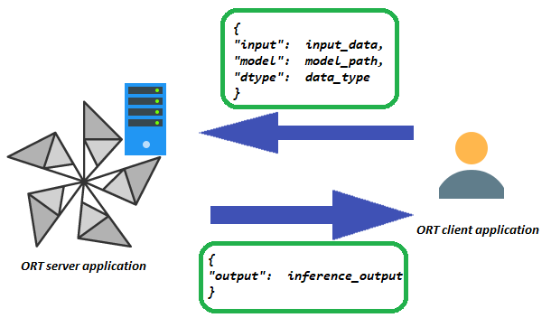

# onnxruntime-server
inference engine based on microsoft onnx runtime
ONNX Runtime Server provides an easy way to start an inferencing server for prediction with HTTP

# HOW TO USE ONNX RUNTIME SERVER FOR PREDICTION
## START THE SERVER
The CLI command to start the server:

python server.py --port < port_number >

## REQUEST AND RESPONSE PAYLOAD
### REQUEST PAYLOAD
The HTTP request header field Content-Type tells the server how to handle the request.

I use the 'application/json' as a content-type, this is the format of the json payload:

{
"input": < the input in python list format >,
"model": < the model's name in the 'models' folder >,
"dtype": < the data type to reconstruct in the server side >
}

### RESPONSE PAYLOAD
{
"output": < a python list of outputs of the model >
}

## INFERENCING
To send a request to the server, you can use any tool which supports making HTTP requests

I use the requests python library to send requests with json format, you can find the example code in 'ortclient.py'

# ARCHITECTURE(simplified)

